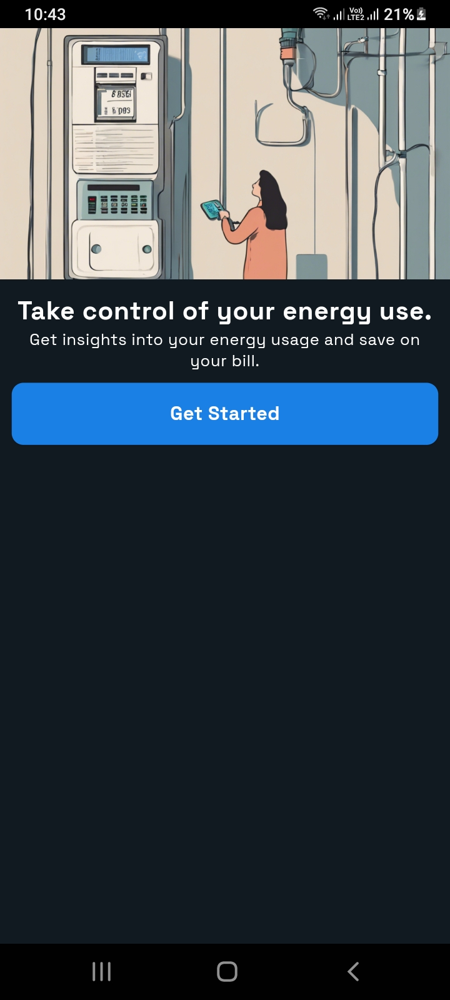
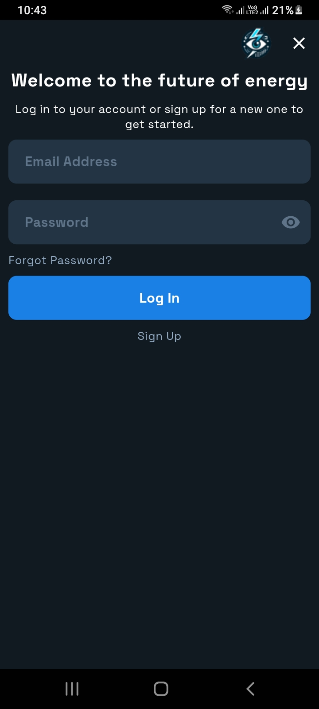
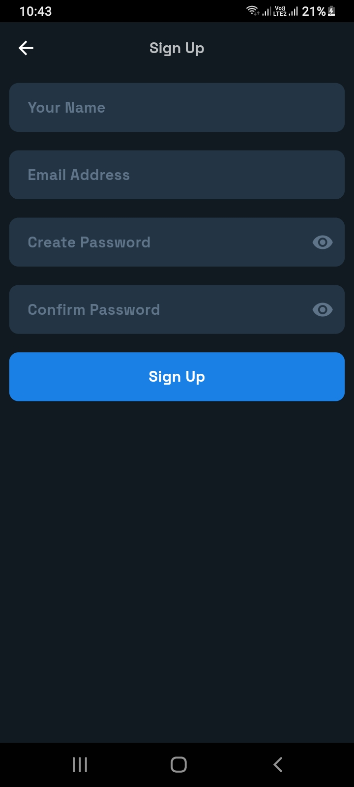
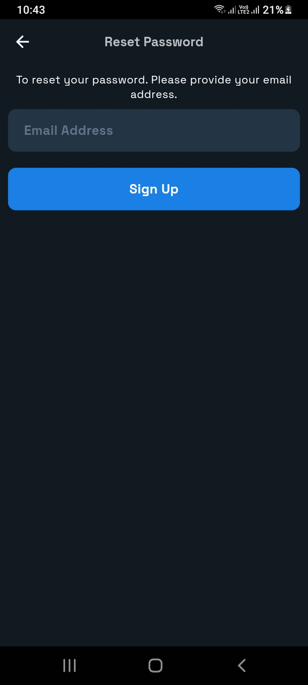
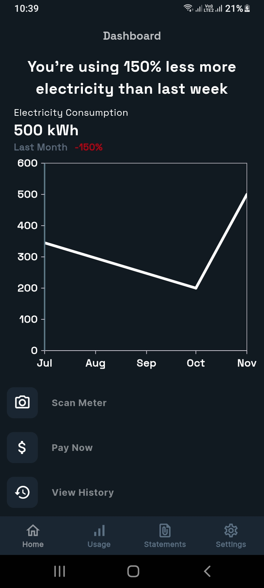
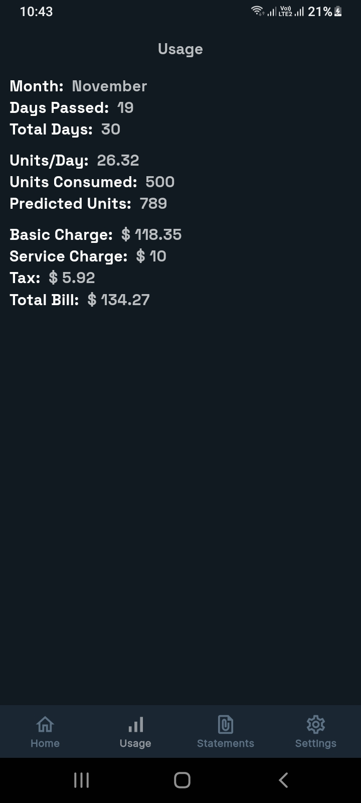
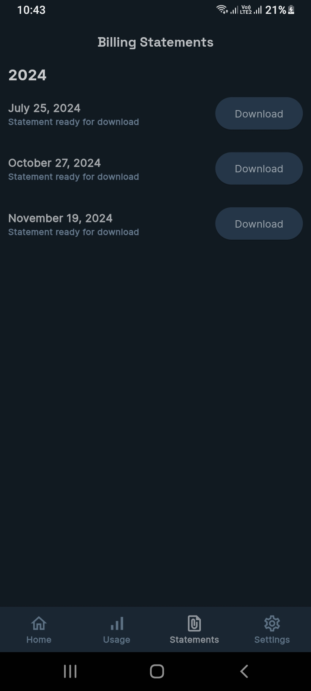
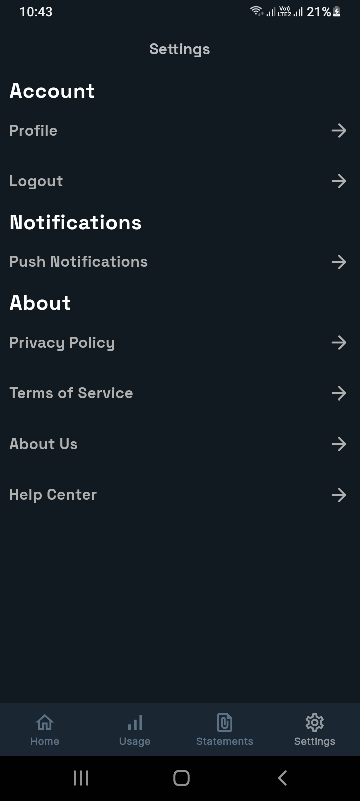

# Volt Vision: Electric Meter Reader
This project is a **Flutter** based mobile application paired with a **Node.js** backend and **MongoDB Atlas** database to streamline electric meter reading and billing processes. The app uses image processing and machine learning to automate meter readings while offering features like billing, payments, and usage tracking.

## Features
- **Automated Meter Reading:** Captures and processes electric meter images.
- **Usage Tracking:** Maintains a history of electricity usage.
- **Bill Generation:** Automatically generates accurate bills based on meter readings.
- **Bill Payments:** Securely processes bill payments through the app.
- **Consumption Analysis:** Visualizes electricity usage patterns.
- **Notifications:** Sends alerts for bill due dates and usage updates.
- **User Account Management:** Supports user profiles with secure authentication.

## Technology Stack

| **Category**              | **Technology**                             | **Details**                                                                 |
|----------------------------|--------------------------------------------|-----------------------------------------------------------------------------|
| **Frontend**               | Flutter                                   | Cross-platform framework for building the mobile application.              |
| **Backend**                | Node.js, Express.js                       | Node.js for server-side scripting and Express.js for REST API development. |
| **Database**               | MongoDB Atlas                             | Cloud-based NoSQL database for scalable and secure data storage.           |
| **Programming Languages**  | Dart, JavaScript                          | Dart for Flutter frontend and JavaScript for backend development.          |
| **Machine Learning**       | Trained Model for Image Recognition       | Machine learning model to process and extract meter readings from images.  |
| **Authentication**         | JWT (JSON Web Tokens)                     | Ensures secure user authentication and session management.                 |
| **APIs**                   | REST APIs                                 | Enables communication between frontend and backend.                        |

## Screen Shots

  

  

 

## System Setup

### Server Setup
- Clone the repository:
  
  ```
  git clone https://github.com/Sheroz-Akram/Volt-Vision.git
  ```
  
- Install Node.js Dependencies:
  
  ```
  cd server

  npm install
  ```
  
- Configure environmental variables:
  
  ```
  HOST=""                     # Your backend host URL or IP address

  CONNECTION_URI=''           # MongoDB Atlas connection string

  TOKEN_SECRET=""             # Secret key for JWT token generation

  SMTP_HOST=""                # SMTP server host

  SMTP_PORT=                  # SMTP server port (e.g., 587)

  SMTP_EMAIL_ADDRESS=""       # Email address for sending notifications

  SMTP_EMAIL_PASSWORD=""      # Password for the SMTP email account

  ROBOFLOW_MODEL_ID=""        # Roboflow model ID for image processing

  ROBOFLOW_API_KEY=""         # Roboflow API key for authentication
  ```

- Install Node.js Dependencies:
  
  ```
  npm start
  ```
  
### Client Application Setup

- Configure the Base URL in Network class:

  ```
  cd app/lib/classes
  ```

  ```
  final String baseUrl = "YOUR HOST HERE";
  ```

- Get the Flutter Dependencies:

  ```
  flutter pub get
  ```

- Run the Flutter Applcation:

  ```
  flutter run
  ```

- Build Android APK File & Install on Device:

  ```
  flutter build apk
  ```
